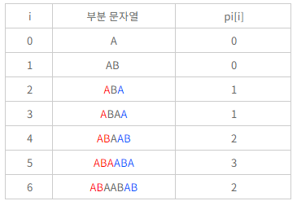

# 문자열

### 패턴 매칭에 사용되는 알고리즘

- 라빈 - 카프 알고리즘, 보이어-무어 알고리즘, KMP 알고리즘
  - 전략적으로 비교함

## 라빈-카프 알고리즘

- 문자열 검색을 위해 해시 값 함수를 이용
- 패턴 내의 문자들을 일일이 비교하는 대신에 패턴의 해시 값과 본문 안에 있는 하위 문자열의 해시 값만 비교
- 최악 O(NM)이지만 일반적으로는 선형 시간임

## KMP 알고리즘

- 불일치가 발생한 텍스트 문자열의 앞 부분에 어떤 문자가 있는지를 미리 알고 있으므로, 불일치가 발생한 앞 부분에 대하여 다시 비교하지 않고 매칭을 수행
- 패턴을 전 처리하여 부분 일치 테이블 배열 pi[k]를 구해서 잘못된 시작을 최소화함
- 일반적인 브루트 포스 방식에 비하여 이전 탐색의 정보를 적극 활용

### pi[i] 배열

- 접두사와 접미사 같은 문자열



- 왜 이런 pi[i] 배열을 구해야하는가?
  - 접두사가 같은 부분을 골라 문자열 탐색을 최적화 한다.’
  - 매칭 실패시 돌아갈 인덱스를 찾는 과정


## 문제 예시 : 찾기 (P5)

[1786번: 찾기](https://www.acmicpc.net/problem/1786)

## 풀이

### pi[i] 테이블 (실패 테이블) 만들기

```jsx
	public static int[] makeFaliureTable() {
		//실패 테이블 선언
		int[] pi = new int[pattern.length()];

		int idx = 0;
		for (int i = 1; i < pattern.length(); i++) {
			//접두사와 접미사가 일치하지 않으면 idx를 이전 단계로 되돌린다.
			while (idx > 0 && (pattern.charAt(idx) != pattern.charAt(i))) {
				idx = pi[idx - 1];
			}

			//접두사와 접미사가 일치하면 idx를 늘리면서 테이블에 기록한다.
			if (pattern.charAt(idx) == pattern.charAt(i)) {
				pi[i] += ++idx;
			}
		}
		return pi;
	}
```

### 실패 테이블을 가지고 효율적으로 인덱스를 돌아가는 과정

```jsx
	public static void solution(String str, int[] pi) {
		int size = str.length();

		int idx = 0;
		for (int i = 0; i < size; i++) {
			while (idx > 0 && (pattern.charAt(idx) != str.charAt(i)))
				idx = pi[idx - 1];


			if (str.charAt(i) == pattern.charAt(idx)) {
				// 패턴의 끝만큼 도달했다면
				if (idx == patternSize - 1) {
					count++;
					//기존에 존재하던 길이에 현재 패턴이 맞는 시작 위치
					sb.append(ans + i - idx + 1).append(" ");
					idx = pi[idx];
				} else
					idx++;
			}
		}
	}
```
