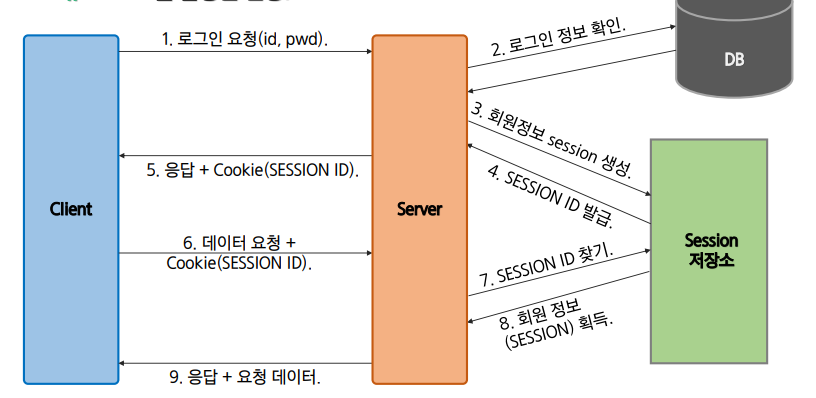

# JWT

### 세션과 쿠키를 활용한 인증

- Cookie는 일반적으로 노출이 된다.
- 또한 브라우저마다 자원의 형태가 달라 인증 저장으로는 좋지 않다.
- 이걸 보완하기 위해 클라이언트 인증 정보를 Cookie가 아니나 서버측에 저장하는 **세션**을 활용했다.

### 세션을 활용한 인증



### 세션의 단점

- User의 Session 정보를 서버에 저장하는 부담
- 쿠키에 저장되는 세션 아이디 자체는 보안에 문제가 되지 않지만, 해당 쿠키로 클라이언트인 척 위장 가능함
- 매번 세션 저장소 조회
- 이걸 보안하기 위해 나온 것이 **Token**

## Token

> *JSON 기반 직렬화 및 위/변조 방지 위한 개인키가 포함된 Token*
> 
- 클라이언트가 서버에 접속하여 사용자 인증을 했을 때 유일 값인 **Token**을 발급
- 서버에 요청을 보낼 때 요청의 헤더에 토큰을 넣어서 보냄
- 클라이언트가 보낸 토큰과 서버 토큰이 같은지 체크하여 인증 처리
- only 앱과 서버의 통신 및 인증에 사용

### 세션 vs Token


### Token 단점

- 토큰 자체 데이터가 길다 → 많은 인증 요청에 네트워크 부하 증가
- 탈취 문제 → *expire 설정으로 해결..?*

## JWT

### JWT 구성


```jsx
Header
{
"alg": "HS256",
"typ": "JWT"
}

Payload
{
"userid": "ssafy",
"name": "안효인",
"class": 10
}

Signature
HMACSHA256( 
base64UrlEncode(header) + "." +
base64UrlEncode(payload), 
your-256-bit-secret
)

```

- **Header**
    - JWT에서 사용할 토큰의 타입과 암호화 알고리즘 정보로 구성
    - key - value 형태
- **Payload**
    - 서버로 보낼 사용자 권한 정보와 데이터로 구성
    - 토큰의 Claim 정보 포함
    - **Claim** : payload에 담는 정보의 한 조각 → key - value 형식으로 이루어진 한 상의 데이터
    - 여러 Claim을 담을 수 있음
    - payload에는 민감한 정보를 담으면 안된다. → 암호화 하지 않음
- **Signature**
    - Key를 포함하며 암호화
    - 토큰 유효성 검사

### Refresh Token

- AccessToken의 유효기간을 짧게하고 어느 기간 동안 사용후 재발급 목적으로 사용
- 인증정보는 담지 않는다.

### AccessToken과 Refresh Token 사용한 로그인 절차

1. 로그인 후 AccessToken과 Refresh Token을 받는다.
2. AccessToken을 사용해 잘 인증한다
3. 어느 기간 만료 후 AccessToken가 만료되었다.
4. Refresh Token을 사용해 서버에게 AccessToken을 요청한다. 
5. 새로운 AccessToken을 받고 *2*로 돌아간다. 


